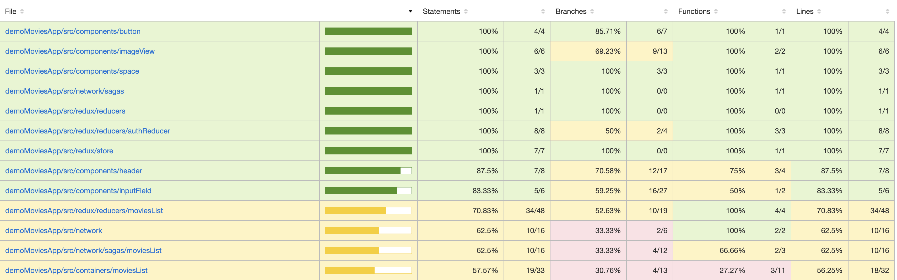
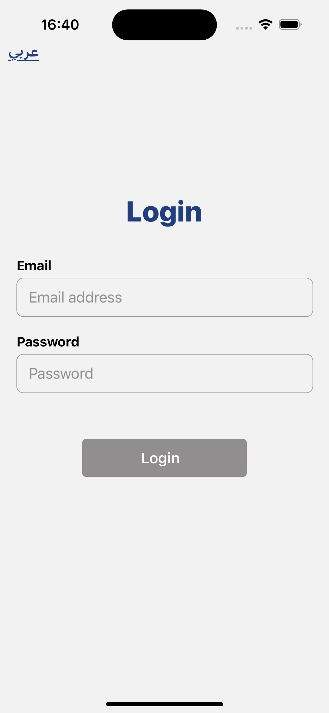
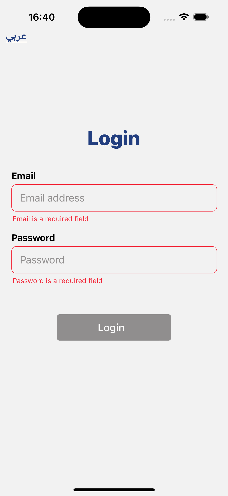
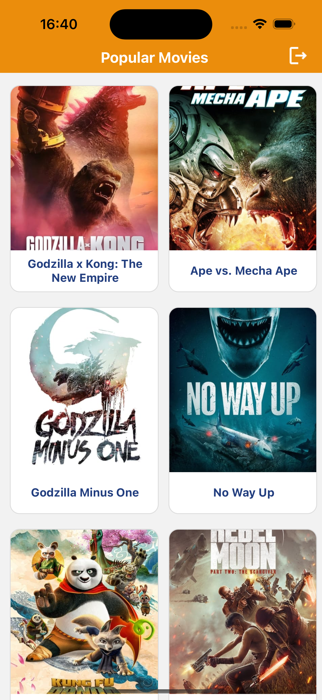

# DEMOMovies App

This is the repository of the MobileRN application version 1. In this application we follow a singleton index Redux Architecture.


/index: It serves as the default entry point for every React Native application. This file remains unchanged.

/src/: This directory holds all the resources generated by the team for our application and serves as the core source code. The "/App.tsx" file acts as the container for our app and serves as the entry point.

/assets: As the name suggests, all static assets should reside here. Each asset should be registered and exported from the /index.ts file. This allows all assets to be accessible and imported from '/assets'.

/components: Only shared components used across features should be placed here. All components should be registered and exported from /index.ts for a single access point. Each component should bear a named export to avoid conflicts. Components with complex logic or Redux integration can be further de-structured into "ComponentContainer.tsx" and "ComponentView.tsx" as per the "Container-View pattern" (this will be covered ahead in /screens or page part).

/containers: This directory serves as the heart of our application, where various features/screens/pages are defined. For example, login, onBoarding, and home are three different screens of this app. Each screen consists of an index.ts file that exports the screen’s container as the default module, making the screen available to be utilized as a component.

/navigation: This directory houses all the routing logic of the application. While this app contains only one stack of navigation, most apps will have at least two navigators: one before and one after authentication. Ideally, all different navigators should be refactored into separate files and then used in "Navigator.tsx". ROUTES.ts contains all the constants for various available routes within our app. The /components directory will hold all the navigation-specific components like headers, title bars, action buttons, and so on.

/redux: This directory holds all the Redux resources in one place, including action creators, reducers, and the store of our app. The /redux/action directory contains all the action types, while /redux/action consists of all the action creators. For a wider scope of the app, this can become an app-level root reducer that merges various feature-level reducers using Redux's combineReducers function. /store is the central store of the application, incorporating all the mapping between reducer, store, and middlewares if any. We have a Redux Saga middleware in our app for enabling asynchronous dispatching of actions.

/network: This directory manages all API requests and serves as a bridge or adapter between the server API and the view layer (scenes and components) of your application. It takes care of network calls your app will make, gets and posts content, and transforms payloads as needed before being sent or saved in the store of your app (such as Redux and Redux Saga). The screens and components will only dispatch actions, read the store, and update themselves based on the new changes. Actions will use services. Saga is a Redux middleware used to handle asynchronous actions and side-effects. You can use fetch for REST API calls in your service handlers.

/utils: This directory contains all utility/helper methods, validations, etc., that can be shared across our entire project.

/styles: This module holds our application-level styles, including theme definition (font, colors, typography) of the app UI and global styles. These are then referenced in individual components using React Native's multiple-style syntax.

/**tests** : Jest framework is default supported by react for unit testing the application. All the unit test files are placed inside “**tests**” dir alongside the corresponding .tsx or .ts files. It can be components, miscellaneous functions, containers, or like so.

## Features

- **React-Navigation**: Handles navigation throughout the application.
- **Redux (Actions & Reducer)**: Manages application state using Redux actions and reducers.
- **Redux-saga**: Enables handling of asynchronous actions and side-effects in Redux.
- **Redux persist**: Persists Redux state across app sessions, ensuring data integrity.
- **Common Screens (Components and Container)**: Contains reusable screens and their containers.
- **Common Components**: Provides reusable UI components used across different screens.
- **Utils (Color, String, styles)**: Includes utility functions for color manipulation, string operations, and styles.
- **Network Wrapper**: Manages API requests and responses, acting as a bridge between the server API and the application.
- **APIs**: Handles communication with external APIs to fetch or send data.
- **Asset**: Stores static assets such as images, icons, and fonts used in the application.

# Getting Started

## Running the Application Locally

To run the application on your local machine, you need to set up the environment for React Native development. Follow the official React Native CLI installation instructions [here](https://reactnative.dev/docs/environment-setup).

- Uses React v18.2.0 and React Native v0.74.1.

## Getting Started

**Clone the repository:**

```bash
git clone https://github.com/narsinghtomar/demoMoviesApp.git
```

After setting up React Native and cloning the repository, Move the run the following commands to start the application on a simulator/emulator:

```bash
yarn install
react-native run-ios
react-native run-android
```

For iOS:

```bash
cd demoMoviesApp
pod install
npx react-native run-ios

```

For Android:

```bash
npx react-native run-android
```

Additionally, you can install dependencies and run the application with:

npm start: Starts the React Native package manager.
npm test: Executes tests and prepares a code coverage report.
npm run lint: Lints the code using ESLint with the popular Airbnb config.
Code Quality Assurance
Before pushing code to the repository, developers should run the following script:

```bash
yarn lint && yarn test
```

This script ensures that there are no lint issues and also generates a code coverage report. The code coverage report can be found at coverage/index.html. Developers should analyze the report to ensure full code coverage before committing the code.

# Android Build

cd android #Clean build: `./gradlew clean`

#Create debug build: $ `./gradlew assembleDebug`

#Create apk release build: $ `./gradlew assembleRelease`

#Create Bundle release build: `./gradlew bundleRelease`

# Testing

The project currently contains unit-tests for the components, at same path with name suffixed .test.ts.

Run npm test to execute these tests. This will generate a coverage report under coverage folder. To view this report open coverage -> lcov-report and click on index.html.


# App Screens (Displays)

# Login




# Movies



```

```
